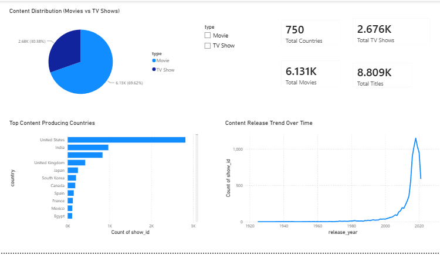

# 🎬 Netflix Content Analysis Dashboard (Power BI)

## 📌 Project Overview
An interactive **Power BI Dashboard** analyzing Netflix's global content library (movies and TV shows). This report tracks key metrics, geographical distribution, and release trends over time to uncover insights into catalog growth.

---

## 📊 Dashboard Preview

---

## 🔑 Key Features & Insights
* **KPI Summary Cards:** Instant metrics for Total Titles (8,809), Total Movies (6,131), Total TV Shows (2,676), and Total Producing Countries (750).
* **Content Distribution:** Pie chart breaking down Movies (~69.6%) vs. TV Shows (~30.4%).
* **Top Producing Countries:** Horizontal bar chart highlighting leading content hubs (United States, India, United Kingdom, etc.).
* **Release Trends Over Time:** Line chart demonstrating content acquisition growth across release years.
* **Interactive Filtering:** Built-in slicer to seamlessly toggle between Movies and TV Shows.

---

## 🛠️ Tools Used
* **Power BI Desktop:** Dashboard Design, Visualizations, KPI Cards, Slicers
* **Data Source:** `archive.zip`

---

## 🚀 How to View
1. Download the `netflix_content_analysis_powerBI.pbix` file from this repository.
2. Open it using **Power BI Desktop**.
